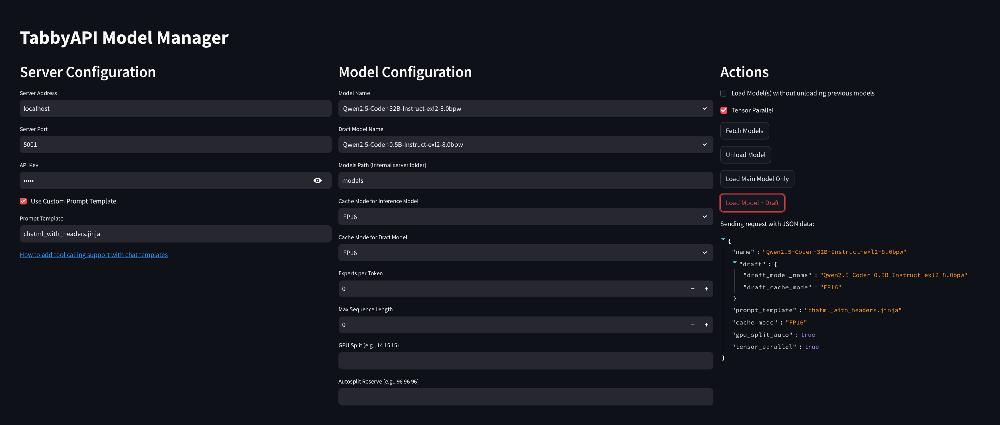

# 🚀 TabbyAPI Model Manager



A Streamlit-based web interface for managing TabbyAPI server with ease!

## 🌟 Features

Easy GUI to control tabbyAPI server:

- 📦 Model loading/unloading
- 🔄 Cache mode selection (FP16, Q8, Q6, Q4)
- 🧠 Tensor Parallel support
- 🔍 Model fetching and selection
- ⚙️ Advanced configuration options:
  - GPU split allocation
  - Autosplit reserve
  - Max sequence length
  - Experts per token
- 📝 Custom prompt template enabling (for tool calling)
- 🎛️ Speculative decoding load (main model + draft)

## 🛠️ How to Use


## 🚦 Requirements

- Python 3.8+
- Streamlit
- Requests library

## ⚡ Quick Start

1. Install dependencies:
   ```bash
   pip install streamlit requests
   ```

2. Run the application:
   ```bash
   streamlit run loader.py
   ```

3. Open your browser to the provided URL (usually http://localhost:8501)

4. **Server Configuration** ⚙️
   - Set your server address and port
   - Enter your API key

5. **Model Management** 📦
   - Fetch available models using the "Fetch Models" button
   - Select your main model and (optional) draft model  from the dropdowns
   - Configure cache modes and other advanced settings

6. **Actions** ▶️
   - Load single model or both main+draft models
   - Unload current model
   - Enable/disable tensor parallel
   - Use custom prompt templates

## 📚 Documentation

For more information about TabbyAPI and its features, visit:
- [TabbyAPI GitHub Wiki](https://github.com/theroyallab/tabbyAPI/wiki)
- [Tool Calling Documentation](https://github.com/theroyallab/tabbyAPI/wiki/10.-Tool-Calling)

## 🤝 Contributing

Contributions are welcome! Please open an issue or submit a pull request.

## 📜 License

MIT License - See LICENSE file for details
